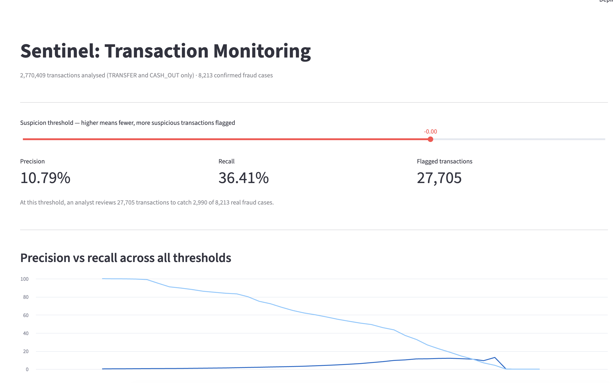

# Sentinel: Transaction Monitoring & Fraud Detection Pipeline

A three-layer fraud detection system built on 6.36 million synthetic banking
transactions, combining SQL-based rules, unsupervised machine learning, and
an interactive analyst dashboard. Built to explore, and honestly measure,
the tradeoff between catching fraud and overwhelming analysts with false
alarms.

**Live evaluation, not a black box.** Every claim below is backed by a
number computed directly from the dataset, not an assumption.

---

## The problem

Fraud detection systems live and die on one tradeoff: catch more fraud,
and you flood analysts with false alarms; reduce false alarms, and real
fraud slips through. This project builds two different detection
approaches, measures each one honestly on the same ground truth, and
shows the tradeoff on an interactive dashboard rather than hiding it
behind a single accuracy number.

## What's built

**Layer 1 — Ingestion.** Loads the [PaySim synthetic transactions
dataset](https://www.kaggle.com/datasets/ealaxi/paysim1) (6.36M rows) into
DuckDB for fast local SQL analytics without a database server.

**Layer 2 — SQL rule engine.** A window-function-based rule that flags
transactions which fully drain the origin account, the actual fraud
signature confirmed in this dataset through direct data profiling.

- 1,188,074 transactions flagged
- 97.6% recall (catches nearly all real fraud)
- 0.7% precision (1 in ~148 flagged transactions is real fraud)

**Layer 3 — Isolation Forest model.** An unsupervised anomaly detection
model trained on six engineered features (balance deltas, amount-to-balance
ratio, drain flag, transaction type) that produces a continuous suspicion
score instead of a fixed yes/no rule.

| Threshold | Flagged | Precision | Recall |
|---|---|---|---|
| Loosest  | 277,041 | 2.21%  | 74.67% |
| Middle   | 27,705  | 10.79% | 36.41% |
| Tightest | 2,824   | 12.39% | 4.26%  |

**Layer 4 — Interactive dashboard.** A Streamlit app with a live threshold
slider, letting a user trade precision against recall in real time and see
exactly how many transactions an analyst would need to review at any
setting.

## What I learned building this

The first version of the SQL rule compared each transaction to that
customer's own historical average. It returned zero results. Profiling
the data showed why: 99.85% of senders in this dataset only transact once,
so there was no history to compare against. The rule wasn't buggy, the
underlying assumption was wrong. I rebuilt it around the dataset's actual
fraud signature (full account drains) instead.

The first fraud-rate calculation on the rebuilt rule also returned 0%,
because I had sorted by transaction size before measuring, which silently
excluded the real fraud cases (fraud here isn't correlated with being the
single largest transaction). Removing that sort and measuring across the
full flagged set gave the real 97.6% / 0.7% numbers above.

Both of those are left in the commit history intentionally.

## Honest limitations

This is synthetic data (PaySim), and its fraud pattern, a full account
drain, is a stronger and more obvious signal than most real-world fraud
is designed to leave. Real transaction monitoring systems face adversarial
actors deliberately structuring transactions to avoid detection, which
this dataset does not model. This project demonstrates the evaluation
methodology, not a production-ready fraud model.

## Stack

Python, DuckDB, SQL (window functions, CTEs), pandas, scikit-learn
(Isolation Forest), Streamlit, pytest (in progress).

## Running it locally

\`\`\`bash
git clone https://github.com/aryannn7/sentinel-txn-monitor.git
cd sentinel-txn-monitor
python3 -m venv .venv && source .venv/bin/activate
pip install -r requirements.txt

# Download PaySim CSV from Kaggle into data/PS_20174392719_1491204439457_log.csv

python src/model.py     # trains model, saves scored_transactions.parquet
streamlit run app.py    # launches dashboard
\`\`\`

## Roadmap

Unit tests for the SQL rule and evaluation functions. Possible LLM layer
using the Claude API to generate plain-English explanations for flagged
transactions, evaluated for cost and hallucination rate before being
added, not just bolted on.

---

Built by [Aryan Dhawan](https://www.linkedin.com/in/aryan-dhawan7),
MSc Business Analytics, University of Manchester. Looking for AI/Data
Engineering roles in the UK from September 2026.
